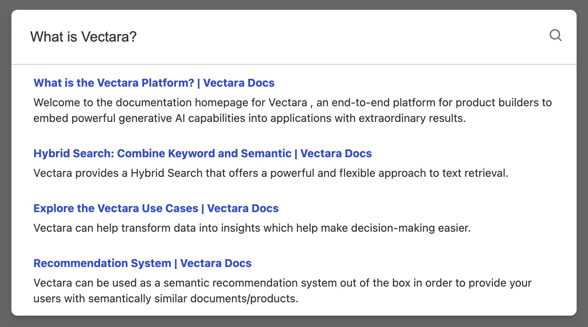

<p align="center">
  
</p>

# React-Search

Use React-Search to add [Vectara](https://vectara.com/) semantic search to your React apps with a few lines of code.

The search input looks like this:


When the user clicks the search input, they get a search prompt like this:


Search results look like this:



## Usage

Install React-Search:

```shell
npm install --save @vectara/react-search
```

Then use it in your application like this:

```js
import { ReactSearch } from "@vectara/react-search";

/* snip */

<ReactSearch
  corpusId="CORPUS_ID"
  customerId="CUSTOMER_ID"
  apiKey="API_KEY"
  placeholder="Search for anything"
/>;
```

React-Search pulls data from your Vectara corpus. To set this up, [create a free Vectara account](https://console.vectara.com/signup) and refer to our [docs](https://docs.vectara.com/docs) for help.

## Maintenance

This codebase comes with a development environment to facilitate enhancements and bug fixes. It allows maintainers to quickly iterate on the code and verify changes instantly.

### Running the development environment

From the root directory, run:

```
npm install
```

This will install all dependencies necessary for building the component and running the dev environment. Once this completes, run:

```
npm run dev
```

This spins up an application running at `http://localhost:8080/`. Your latest changes will be reflected here.

### Making changes to the component

Once the development environment is running, any changes made to .ts and .tsx files in the `/src` directory will trigger a rebuild of the component and a reload of the webpage.

Additionally, any changes to the development app source code at `/dev/index.tsx` will also trigger a rebuild + reload.
